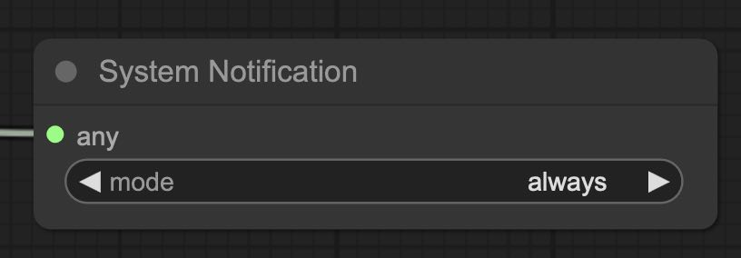
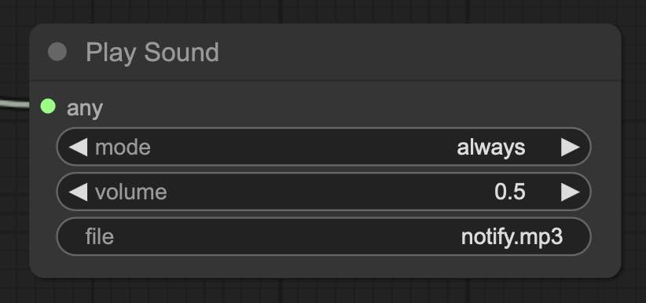
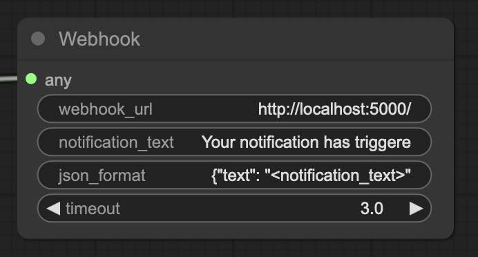
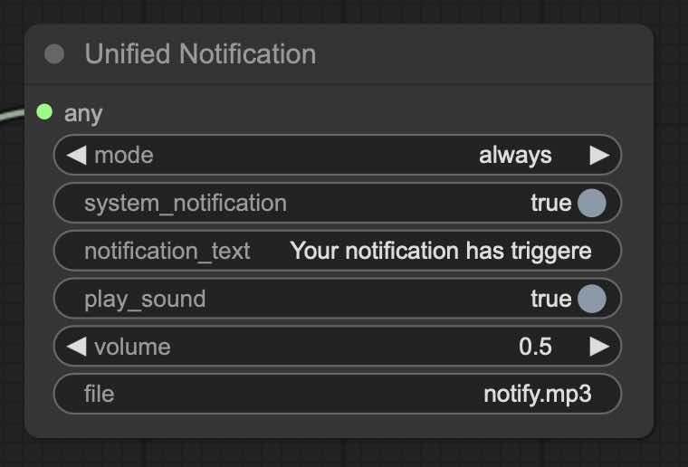

# ComfyUI Notifications

This package provides custom nodes to ComfyUI to notify users when workflows have completed.

These tools are also available via [ComfyUI-Custom-Scripts](https://github.com/pythongosssss/ComfyUI-Custom-Scripts), but this package comes without the bloat of other tools.

## Send Notification

Sends a system notification via the browser.

## Play Sound

Plays a chime sound to notify the user.

By default, the selected sound file is at [`custom_nodes/ComfyUI-Notifications/web/assets/notify.mp3`](web/assets/). You can add custom sounds to this directory and change the file name in the node settings to play a different sound.

Alternatively, you can use a URL to an audio file. Simply enter the URL in the `file` field.

## Webhook

Send a webhook to the specified URL. Supports customizing JSON body with the `json_format` template.

## Unified Notification

Supports multiple notification types in one node for convenience.

